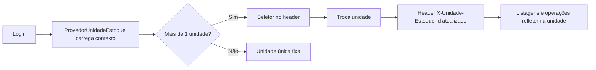

# Estoque multiunidade — Documentação

Documentação da evolução do CanipApp para estoque **Secretaria + Canil**, com rastreabilidade por unidade, entradas separadas do cadastro de item, transferências entre unidades e permissões granulares por usuário.

**Data da implementação:** junho/2026  
**Migration backend:** `20260624011017_EstoqueMultiUnidade`

---

## Sumário

1. [O que mudou (resumo)](#o-que-mudou-resumo)
2. [Conceitos de negócio](#conceitos-de-negócio)
3. [Modelo de dados (backend)](#modelo-de-dados-backend)
4. [API — endpoints novos e alterados](#api--endpoints-novos-e-alterados)
5. [Frontend — arquitetura](#frontend--arquitetura)
6. [Rotas do frontend](#rotas-do-frontend)
7. [Fluxos de uso](#fluxos-de-uso)
8. [Permissões de usuário](#permissões-de-usuário)
9. [Compatibilidade e legado](#compatibilidade-e-legado)
10. [Arquivos principais](#arquivos-principais)

---

## O que mudou (resumo)

### Antes

- Estoque único, implicitamente da Secretaria.
- Cadastro de produto/medicamento/insumo podia criar **lote e quantidade inicial** no mesmo formulário.
- Entrada de estoque usava `POST /api/Estoque` (criação de lote genérico).
- Usuários tinham apenas permissão global: **Administrador** ou **Leitura**.
- Não havia transferência entre locais nem seletor de unidade na interface.

### Agora

- Duas unidades de estoque: **Secretaria** (id `1`) e **Canil** (id `2`).
- Saldo, movimentações, retiradas e níveis mínimos são **por unidade**.
- Catálogo de itens (produto/med/insumo) continua **global**; o que muda é o saldo em cada unidade.
- Cadastro de item cria apenas a **ficha** (saldo zero). Entrada é um fluxo à parte.
- Entradas registradas como **Compra** ou **Doação** via `POST /api/Estoque/entradas`.
- **Transferências** entre Secretaria ↔ Canil com confirmação de recebimento.
- Cada usuário tem vínculo com uma ou mais unidades (`UsuariosUnidadesEstoque`) com flags granulares.
- No **cadastro**, o usuário escolhe apenas **Secretaria** ou **Canil**; o admin ajusta permissões finas depois.
- Frontend envia header `X-Unidade-Estoque-Id` em todas as requisições autenticadas de estoque.

---

## Conceitos de negócio

| Conceito | Descrição |
|----------|-----------|
| **Unidade de estoque** | Local físico/lógico com saldo próprio. Hoje: Secretaria e Canil. |
| **Catálogo global** | Produtos, medicamentos e insumos existem uma vez no sistema. |
| **Saldo por unidade** | `ItensEstoque` tem chave composta `(Id, IdUnidadeEstoque, Lote)`. |
| **Entrada** | Aumenta saldo na unidade ativa (compra ou doação). Gera movimentação no ledger. |
| **Saída (retirada)** | Diminui saldo na unidade ativa. |
| **Transferência** | Sai da unidade origem (envio) e entra na destino (recebimento confirmado). |
| **Unidade ativa** | Unidade selecionada no header do app; define escopo das consultas e operações. |

### Regras acordadas

- Estoque existente na base legada foi migrado para **Secretaria** (`IdUnidadeEstoque = 1`).
- O **Canil** começa vazio e recebe estoque por compra, doação ou transferência da Secretaria.
- Administradores podem ter acesso às duas unidades com todas as permissões.
- Usuários comuns, no cadastro, ficam vinculados a **uma** unidade com permissões padrão.

---

## Modelo de dados (backend)

### Novas tabelas

| Tabela | Função |
|--------|--------|
| `UnidadesEstoque` | Cadastro das unidades (SEC, CAN). |
| `UsuariosUnidadesEstoque` | Permissões do usuário por unidade. |
| `MovimentacoesEstoque` | Ledger de todas as movimentações. |
| `TransferenciasEstoque` | Cabeçalho da transferência entre unidades. |
| `TransferenciasEstoqueItens` | Itens/lotes transferidos. |

### Tabelas alteradas

| Tabela | Alteração |
|--------|-----------|
| `ItensEstoque` | PK `(Id, IdUnidadeEstoque, Lote)`; saldo por unidade. |
| `ItensNivelEstoque` | PK `(Id, IdUnidadeEstoque)`; mínimo por unidade. |
| `RetiradaEstoque` | Campos `IdUnidadeEstoque`, `IdMovimentacao`. |

### IDs fixos das unidades

```text
Secretaria = 1
Canil      = 2
```

Definidos em `Backend/Models/Estoque/UnidadeEstoqueIds.cs`.

### Permissões por unidade (`UsuariosUnidadesEstoque`)

| Campo | Significado |
|-------|-------------|
| `PodeConsultar` | Ver listagens e saldos da unidade. |
| `PodeEntrada` | Registrar compra/doação. |
| `PodeSaida` | Registrar retirada. |
| `PodeTransferirEnviar` | Criar/enviar transferência **da** unidade. |
| `PodeTransferirReceber` | Confirmar recebimento **na** unidade. |

---

## API — endpoints novos e alterados

Todas as rotas de estoque exigem autenticação e respeitam o header:

```http
X-Unidade-Estoque-Id: 1
```

(ou `2` para Canil). O backend valida se o usuário logado tem permissão na unidade informada.

### Unidades

| Método | Rota | Descrição |
|--------|------|-----------|
| `GET` | `/api/UnidadesEstoque/contexto` | Unidade ativa sugerida + lista de unidades disponíveis para o usuário. |

### Entradas

| Método | Rota | Descrição |
|--------|------|-----------|
| `POST` | `/api/Estoque/entradas` | Registra entrada (compra ou doação) na unidade ativa. |

**Body (`EntradaEstoqueDTO`):**

```json
{
  "idItem": 10,
  "tipoEntrada": 1,
  "quantidade": 50,
  "dataEntrega": "2026-06-23T00:00:00Z",
  "dataValidade": "2027-06-23T00:00:00Z",
  "nfe": "12345",
  "fornecedorNome": "Fornecedor X",
  "fornecedorDocumento": "00.000.000/0001-00",
  "doadorNome": null,
  "doadorDocumento": null,
  "observacao": "Observação opcional",
  "nivelMinimoEstoque": 10
}
```

`tipoEntrada`: `1` = Compra, `2` = Doação.

### Transferências

| Método | Rota | Descrição |
|--------|------|-----------|
| `GET` | `/api/TransferenciasEstoque` | Lista transferências visíveis ao usuário. |
| `POST` | `/api/TransferenciasEstoque` | Cria e envia transferência da unidade ativa. |
| `POST` | `/api/TransferenciasEstoque/{id}/receber` | Confirma recebimento na unidade destino. |

### Usuários (extensão)

| Método | Rota | Descrição |
|--------|------|-----------|
| `GET` | `/api/Usuarios/{id}/unidades-estoque` | Lista permissões do usuário por unidade. |

**Create/Update** aceitam `unidadesEstoque[]` no body:

```json
{
  "idUnidadeEstoque": 1,
  "podeConsultar": true,
  "podeEntrada": true,
  "podeSaida": true,
  "podeTransferirEnviar": true,
  "podeTransferirReceber": false
}
```

### Legado bloqueado

| Método | Rota | Comportamento |
|--------|------|---------------|
| `POST` | `/api/Estoque` | Retorna erro orientando uso de `/api/Estoque/entradas`. |

### Consultas existentes (comportamento novo)

Estas rotas **já existiam**, mas agora filtram pela unidade do header:

- `GET /api/Estoque/pagination`
- `GET /api/Estoque/contagens`
- `POST /api/RetiradaEstoque/{lote}`
- Histórico de retiradas

---

## Frontend — arquitetura

### Árvore de providers

```text
ProvedorTemaApp
  └── ProvedorAutenticacao
        └── ProvedorUnidadeEstoque   ← NOVO
              └── RotasApp
```

### Contexto de unidade (`ProvedorUnidadeEstoque`)

Arquivo: `frontend/src/app/providers/ContextoUnidadeEstoque.tsx`

Após o login, o provider:

1. Chama `GET /api/UnidadesEstoque/contexto`.
2. Carrega permissões do usuário via `GET /api/Usuarios/{id}/unidades-estoque`.
3. Define a **unidade ativa** (preferência salva em `localStorage` ou sugestão do backend).
4. Expõe `permissoesAtivas` para esconder/desabilitar ações na UI.

**Hook:** `useUnidadeEstoque()`

| Propriedade / método | Uso |
|---------------------|-----|
| `unidadeAtivaId` | ID da unidade selecionada (1 ou 2). |
| `contexto` | Nome, sigla e unidades disponíveis. |
| `permissoesAtivas` | Flags da unidade atual. |
| `definirUnidadeAtiva(id)` | Troca unidade e persiste escolha. |
| `recarregarContexto()` | Recarrega após login ou mudança de permissões. |

### Header HTTP automático

Arquivo: `frontend/src/infrastructure/http/criarClienteHttp.ts`

Toda requisição autenticada inclui:

```http
Authorization: Bearer {token}
X-Unidade-Estoque-Id: {unidadeAtivaId}
```

Chave de persistência: `canilapp_unidade_estoque_ativa` (`armazenamentoUnidadeEstoque.ts`).

### Seletor no header

Componente: `frontend/src/shared/components/SeletorUnidadeEstoque.tsx`

Aparece no `AppShellAutenticado` quando o usuário tem acesso a **mais de uma** unidade.

### Organização por domínio (pastas novas/alteradas)

```text
frontend/src/
├── app/providers/ContextoUnidadeEstoque.tsx
├── domains/estoque/
│   ├── api/
│   │   ├── unidadesEstoqueApi.ts      ← contexto
│   │   ├── entradaEstoqueApi.ts       ← POST entradas
│   │   └── transferenciasEstoqueApi.ts
│   ├── constants/unidadesEstoque.ts   ← IDs + defaults de cadastro
│   ├── types/
│   │   ├── tiposUnidadeEstoque.ts
│   │   ├── tiposEntradaEstoque.ts
│   │   └── tiposTransferencia.ts
│   ├── hooks/useTransferencias.ts
│   ├── components/
│   │   ├── FormularioNovoLote.tsx     ← agora é formulário de ENTRADA
│   │   └── FormularioTransferencia.tsx
│   └── pages/
│       ├── PaginaFormularioEntrada.tsx
│       ├── PaginaListagemTransferencias.tsx
│       └── PaginaFormularioTransferencia.tsx
└── domains/usuarios/
    ├── components/
    │   ├── CampoEscolhaUnidadeCadastro.tsx
    │   ├── FormularioPermissoesUnidade.tsx
    │   └── AbaPermissoesUnidadeAdmin.tsx
    └── pages/PaginaPermissoesUsuarios.tsx
```

---

## Rotas do frontend

### Rotas novas

| Rota | Página | Acesso | Descrição |
|------|--------|--------|-----------|
| `/estoque/entradas/novo` | `PaginaFormularioEntrada` | Autenticado | Formulário de entrada (compra/doação). Query: `?idItem=&codItem=`. |
| `/estoque/transferencias` | `PaginaListagemTransferencias` | Autenticado | Lista transferências; botão receber. |
| `/estoque/transferencias/nova` | `PaginaFormularioTransferencia` | Autenticado | Criar transferência da unidade ativa. |
| `/usuarios/permissoes` | `PaginaPermissoesUsuarios` | **Admin** | Gestão dedicada de permissões por unidade. |

### Rotas alteradas (comportamento)

| Rota | Mudança |
|------|---------|
| `/estoque` | Listagem filtrada pela unidade ativa no header. |
| `/estoque/lotes/novo` | Mantida por compatibilidade; usa o mesmo formulário de entrada. **Preferir** `/estoque/entradas/novo`. |
| `/cadastro` | Campo **Unidade de atuação** (Secretaria ou Canil). |
| `/usuarios` | Nova aba admin **Permissões unidade**. |

### Navegação no menu (sidebar)

Itens adicionados:

- **Transferências** → `/estoque/transferencias`
- **Permissões** → `/usuarios/permissoes` (somente admin)

### Mapa completo das rotas autenticadas

```text
/dashboard
/produtos, /produtos/novo, /produtos/:id
/medicamentos, /medicamentos/novo, /medicamentos/:id
/insumos, /insumos/novo, /insumos/:id
/estoque
/estoque/historico-retiradas
/estoque/transferencias
/estoque/transferencias/nova
/estoque/entradas/novo
/estoque/lotes/novo          (legado — redirecionar mentalmente para entradas)
/estoque/retirada
/estoque/item/:id
/usuarios
/usuarios/permissoes         (admin)
/usuarios/novo                (admin)
```

---

## Fluxos de uso

### 1. Operar na unidade correta



### 2. Cadastrar item (sem estoque)

1. Acesse **Produtos / Medicamentos / Insumos → Novo**.
2. Preencha identificação + nível mínimo (opcional).
3. O item é criado **sem lote** (saldo zero).
4. Para colocar quantidade, use **Entrada de estoque**.

### 3. Registrar entrada

1. Selecione a unidade no header (ex.: Secretaria).
2. Na listagem do item, clique em movimentar **ou** acesse `/estoque/entradas/novo?idItem={id}`.
3. Escolha **Compra** ou **Doação**, informe quantidade, datas e fornecedor/doador.
4. O backend gera o lote e registra a movimentação.

### 4. Transferir entre unidades

1. Na unidade **origem** (ex.: Secretaria), acesse **Transferências → Nova**.
2. Informe unidade destino, itens (id + lote + quantidade) e observação.
3. Na unidade **destino** (Canil), acesse **Transferências** e clique **Receber**.

### 5. Cadastrar usuário

**Cadastro público (`/cadastro`) ou admin (`/usuarios` → Novo usuário):**

- Campo **Unidade de atuação**: Secretaria ou Canil.
- O frontend envia `unidadesEstoque[]` com permissões padrão:

| Escolha | Unidade | Enviar transf. | Receber transf. |
|---------|---------|----------------|-----------------|
| Secretaria | 1 | Sim | Não |
| Canil | 2 | Não | Sim |

Ambos recebem: consultar, entrada e saída.

### 6. Admin — ajustar permissões

Duas formas equivalentes:

- **Aba** em `/usuarios` → **Permissões unidade**
- **Página** `/usuarios/permissoes`

O admin seleciona o usuário e edita a matriz por unidade (checkboxes). Salvar chama `PUT /api/Usuarios/{id}` com `unidadesEstoque`.

---

## Permissões de usuário

### Níveis de permissão

| Camada | Onde se define | O que controla |
|--------|----------------|----------------|
| **Papel global** | `permissao` no usuário (1=Admin, 2=Leitura) | Gestão de usuários, código de acesso, edição de outros usuários. |
| **Unidade + flags** | `UsuariosUnidadesEstoque` | Consulta, entrada, saída e transferências **por unidade**. |

### Defaults no backend (quando `unidadesEstoque` não é enviado)

| Papel | Unidades | Permissões |
|-------|----------|------------|
| Admin | Secretaria + Canil | Todas |
| Leitura | Secretaria | Consultar, entrada, saída, enviar transferência |

O frontend no cadastro **sempre envia** `unidadesEstoque` conforme a escolha Secretaria/Canil.

---

## Compatibilidade e legado

| Item | Status |
|------|--------|
| Banco `canilappDO.db` da Secretaria | Estoque migrado para unidade 1. |
| `POST /api/Estoque` (lote genérico) | Bloqueado — usar entradas. |
| `/estoque/lotes/novo` | Mantido; mesmo UI de entrada. Links novos usam `/estoque/entradas/novo`. |
| Retiradas e histórico | Mantidos; filtrados por unidade ativa. |
| JWT / refresh / login | Sem mudança de contrato. |

---

## Arquivos principais

### Backend

| Arquivo | Responsabilidade |
|---------|------------------|
| `Migrations/20260624011017_EstoqueMultiUnidade.cs` | Schema + backfill unidade 1. |
| `Data/UnidadeEstoqueSeed.cs` | Seed SEC/CAN + vínculos iniciais. |
| `Services/UnidadeEstoqueContextService.cs` | Lê header e valida permissões. |
| `Services/EntradaEstoqueService.cs` | Lógica de compra/doação. |
| `Services/TransferenciaEstoqueService.cs` | Envio e recebimento. |
| `Services/UsuariosService.cs` | Sincroniza `unidadesEstoque` no create/update. |
| `Controllers/UnidadesEstoqueController.cs` | `GET contexto`. |
| `Controllers/TransferenciasEstoqueController.cs` | CRUD transferências. |
| `DTOs/Estoque/UnidadeEstoqueDTO.cs` | DTOs de contexto e permissões. |
| `DTOs/Estoque/EntradaEstoqueDTO.cs` | DTO de entrada. |

### Frontend

| Arquivo | Responsabilidade |
|---------|------------------|
| `app/providers/ContextoUnidadeEstoque.tsx` | Estado global da unidade. |
| `infrastructure/http/criarClienteHttp.ts` | Injeta header de unidade. |
| `domains/estoque/constants/unidadesEstoque.ts` | IDs e defaults de cadastro. |
| `domains/estoque/components/FormularioNovoLote.tsx` | UI de entrada (compra/doação). |
| `domains/usuarios/components/FormularioPermissoesUnidade.tsx` | Matriz admin de permissões. |
| `app/routes/RotasApp.tsx` | Definição de todas as rotas. |
| `domains/estoque/components/SidebarEstoque.tsx` | Itens de menu. |

---

## Deploy e migração

1. Aplicar migration no backend:

   ```bash
   cd backend/Backend
   dotnet ef database update
   ```

2. Subir API e frontend.
3. Usuários existentes recebem vínculo com Secretaria via seed (admin com SEC + CAN).
4. Validar seletor de unidade no header e listagem de estoque por unidade.

---

## Referências cruzadas

- Módulo de usuários (status, auditoria): [`docs/MODULO-USUARIOS.md`](./MODULO-USUARIOS.md)
- Fluxo geral do sistema: [`docs/SYSTEM_FLOW.md`](./SYSTEM_FLOW.md)
- Onboarding frontend: [`docs/frontend-onboarding.md`](./frontend-onboarding.md)
