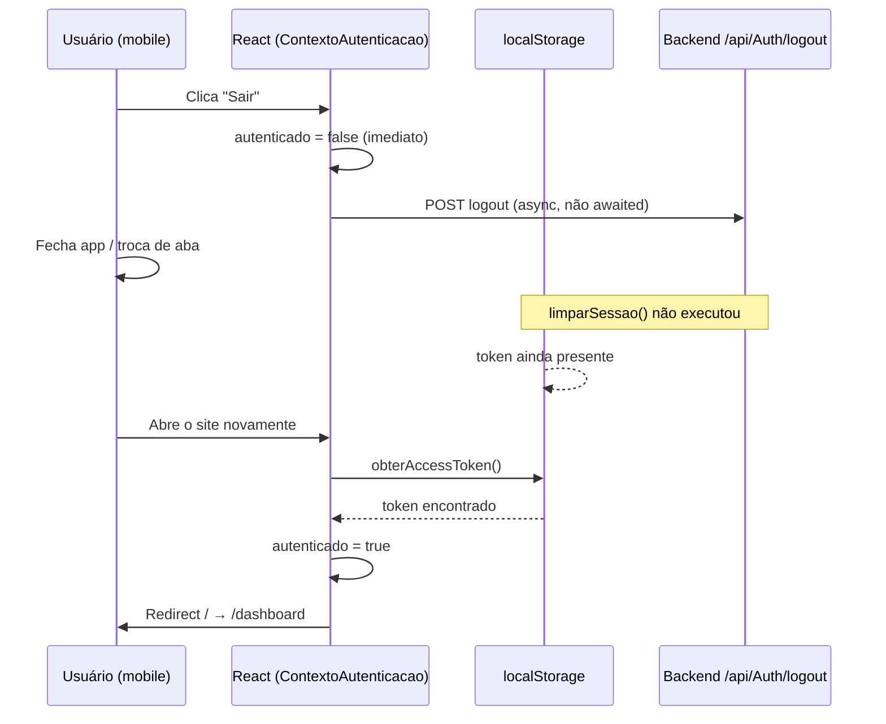

# Problema: após logout no mobile, o site redireciona para o dashboard

Documento técnico que descreve o sintoma, a causa raiz no código atual e o fluxo passo a passo (frontend e backend).

---

## Sintoma

No celular (ou ao fechar o navegador logo após sair):

1. O usuário toca em **Sair** e vê a tela de login.
2. Ao abrir o site de novo (nova aba, atalho na tela inicial, etc.), é enviado para o **dashboard** como se ainda estivesse logado.

No desktop o problema pode passar despercebido; no mobile é mais frequente porque a requisição de logout costuma ser interrompida ou demorar mais.

---

## Resumo da causa

| Camada | O que acontece |
|--------|----------------|
| **Persistência** | A sessão “oficial” no cliente é o par `canilapp_access_token` + `canilapp_usuario` no `localStorage`. |
| **Logout** | O `localStorage` só é limpo **depois** que a API `/api/Auth/logout` responde (ou falha). |
| **UI** | O React marca `autenticado: false` **na hora**, antes da limpeza do storage. |
| **Rotas** | Se o token ainda existir na próxima visita → usuário considerado logado → redirecionamento para `/` → `/dashboard`. |

Não há lógica específica “só para mobile”; o mobile apenas expõe mais a condição de corrida entre UI, rede e persistência.

---

## Passo a passo — como o app sabe que você está logado

### 1. Inicialização do app

Arquivo: `frontend/src/app/providers/ContextoAutenticacao.tsx`

1. Ao carregar a página, o `ProvedorAutenticacao` chama `lerSessaoAtual()`.
2. Essa função lê `localStorage`:
   - chave `canilapp_access_token` → função `obterAccessToken()`
   - chave `canilapp_usuario` → função `obterUsuarioArmazenado()`
3. Define `autenticado = Boolean(token)` — **basta existir token**, não valida expiração nem chama o servidor.

Arquivo: `frontend/src/shared/services/armazenamentoSessao.ts`

```ts
const CHAVE_TOKEN = 'canilapp_access_token';
const CHAVE_USUARIO = 'canilapp_usuario';
```

### 2. Login (para contexto)

Arquivo: `frontend/src/domains/autenticacao/services/servicoAutenticacao.ts`

1. `POST /api/Auth/login` com login e senha.
2. Resposta traz `accessToken` e `usuario`.
3. `salvarSessao(access, usuario)` grava as duas chaves no `localStorage`.
4. O backend também define um cookie **HttpOnly** `refreshToken` (não acessível via JavaScript).

---

## Passo a passo — o que acontece ao clicar em “Sair”

### 3. Botão Sair na interface

Arquivo: `frontend/src/shared/components/AppShellAutenticado.tsx`

1. Usuário clica em **Sair**.
2. Executa, em sequência:
   - `sair()` do contexto de autenticação
   - `navigate('/login')`

### 4. Função `sair()` no contexto (não aguarda o servidor)

Arquivo: `frontend/src/app/providers/ContextoAutenticacao.tsx`

1. Chama `servicoAutenticacao.sair()` **sem `await`** (fire-and-forget).
2. Imediatamente faz `setSessao({ autenticado: false, usuario: null })`.
3. A tela de login aparece porque o **estado React** já está deslogado.

**Importante:** nesse momento o `localStorage` pode ainda conter o token.

### 5. Serviço de logout (limpeza tardia)

Arquivo: `frontend/src/domains/autenticacao/services/servicoAutenticacao.ts`

Ordem atual:

```
1. await solicitarLogoutApi()   ← espera rede (timeout até 30s)
2. limparSessao()               ← só então remove localStorage
```

Em caso de erro da API, o `catch` também chama `limparSessao()` — mas **só depois** da tentativa de rede terminar.

Arquivo: `frontend/src/domains/autenticacao/api/logoutApi.ts`

- `POST /api/Auth/logout` com Bearer token no header (interceptor Axios).

### 6. Cenário que reproduz o bug no mobile

```
Usuário toca "Sair"
    → React: autenticado = false  (UI mostra login)
    → Inicia POST /logout na rede
    → Usuário fecha aba / troca de app / rede lenta
    → limparSessao() NUNCA executa (requisição abortada ou pendente)
    → canilapp_access_token permanece no localStorage
```

Na próxima abertura do site, o passo 1 (inicialização) encontra o token e trata o usuário como logado.

---

## Passo a passo — por que a próxima visita vai ao dashboard

### 7. Usuário abre o site de novo

1. `lerSessaoAtual()` encontra token no `localStorage`.
2. `autenticado === true`.

### 8. Rota de login redireciona quem já está autenticado

Arquivo: `frontend/src/domains/autenticacao/pages/PaginaLogin.tsx`

1. Se `autenticado`, renderiza `<Navigate to={destino} replace />`.
2. `destino` padrão é `'/'` (não `/dashboard` diretamente).

### 9. Rota raiz sempre manda para o dashboard

Arquivo: `frontend/src/app/routes/RotasApp.tsx`

1. `path="/"` com `index` → `<Navigate to="/dashboard" replace />`.
2. `/dashboard` está dentro de `RotaProtegida`, que exige `autenticado`.
3. Como o token ainda existe, a rota protegida libera o acesso.

**Fluxo resumido:**

```
localStorage com token
  → autenticado = true
  → /login redireciona para /
  → / redireciona para /dashboard
  → usuário vê o dashboard
```

### 10. Rota protegida (comportamento esperado quando não há token)

Arquivo: `frontend/src/shared/components/RotaProtegida.tsx`

- Se `!autenticado` → `<Navigate to="/login" state={{ de: retorno }} />`.
- Isso só funciona quando o `localStorage` foi limpo de fato.

---

## Passo a passo — backend no logout

### 11. Endpoint de logout

Arquivo: `backend/Backend/Controllers/AuthController.cs`

1. Rota: `POST /api/Auth/logout` (requer `[Authorize]` + Bearer).
2. Lê o cookie `refreshToken` da requisição.
3. Se o cookie existir, revoga o refresh token no banco via `RevokeRefreshTokenAsync`.
4. Retorna `204 No Content`.

### 12. Lacuna: cookie não é removido na resposta

O login e o refresh usam `SetRefreshCookie()` para gravar o cookie HttpOnly.

No logout **não há** `Response.Cookies.Delete("refreshToken")` nem cookie com expiração no passado.

**Impacto hoje:** o frontend não chama `/api/Auth/refresh` na inicialização (`renovarSePossivel` existe em `servicoAutenticacao.ts` mas não é usado em nenhum componente). Por isso o redirecionamento observado vem principalmente do **token no `localStorage`**, não do cookie.

**Impacto futuro:** se alguém implementar renovação automática ao abrir o app, um cookie ainda válido poderia gerar novo access token mesmo após “sair” na UI.

### 13. Cookie de refresh (contexto)

Configuração em `SetRefreshCookie`:

- `HttpOnly: true`
- `Secure: true` (apenas HTTPS)
- `SameSite: Lax`

O cliente Axios envia credenciais cross-origin só quando `VITE_URL_BASE_API` está definida (`withCredentials` em `criarClienteHttp.ts`).

---

## Diagrama do fluxo problemático



---

## Como confirmar o problema

1. No mobile (ou DevTools com emulação), faça login.
2. Toque em **Sair** e **feche a aba imediatamente** (ou simule rede lenta e feche antes de 30s).
3. Reabra o site.
4. Inspecione `localStorage` (Application → Local Storage):
   - Se `canilapp_access_token` ainda existir → causa confirmada.

---

## Correções recomendadas

### Prioridade alta (frontend)

1. **Limpar `localStorage` primeiro**, depois chamar a API de logout (best-effort no servidor).
2. **`await` em `sair()`** no contexto e só navegar para `/login` após `limparSessao()` local.
3. Opcional: tratar token expirado no cliente (não considerar `autenticado` só por string no storage).

Exemplo de ordem desejada em `servicoAutenticacao.sair()`:

```
limparSessao()                    ← imediato, síncrono
try { await solicitarLogoutApi() } catch { /* log opcional */ }
```

### Prioridade média (backend)

1. No `Logout`, apagar o cookie `refreshToken` na resposta HTTP.
2. Avaliar logout sem exigir cookie quando o Bearer ainda é válido (revogar por usuário/sub do JWT).

### Prioridade baixa (produto)

1. Mensagem se logout no servidor falhar (`MSG_ERRO.logoutParcial` já existe em `mensagensErroUsuario.ts`).
2. Documentar para QA o cenário “sair e fechar aba rápido”.

---

## Arquivos relacionados

| Arquivo | Papel |
|---------|--------|
| `frontend/src/shared/services/armazenamentoSessao.ts` | Persistência token/usuário |
| `frontend/src/app/providers/ContextoAutenticacao.tsx` | Estado global + `sair()` |
| `frontend/src/domains/autenticacao/services/servicoAutenticacao.ts` | Orquestra login/logout |
| `frontend/src/shared/components/AppShellAutenticado.tsx` | Botão Sair |
| `frontend/src/domains/autenticacao/pages/PaginaLogin.tsx` | Redirect se já autenticado |
| `frontend/src/app/routes/RotasApp.tsx` | `/` → `/dashboard` |
| `frontend/src/shared/components/RotaProtegida.tsx` | Guard de rotas |
| `backend/Backend/Controllers/AuthController.cs` | Login, refresh, logout |

---

## Histórico

| Data | Descrição |
|------|-----------|
| 2026-06-01 | Documento criado a partir da análise do fluxo de autenticação e logout. |
