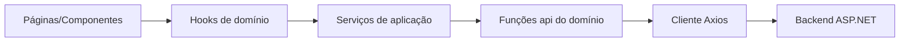

# Onboarding do frontend (CanilApp Web)

Este documento descreve o frontend React na pasta `frontend/`, alinhado ao backend ASP.NET Core em `backend/`.

---

## Visão geral

### Objetivo do frontend

Fornecer uma base **web administrativa** para operar o CanilApp: autenticação JWT, navegação por módulos (produtos, medicamentos, insumos, estoque, sincronização) e cadastro de usuários, com arquitetura preparada para evolução contínua.

### Tecnologias utilizadas

- **React 19** com **TypeScript**
- **Vite** (bundler e servidor de desenvolvimento)
- **React Router** (roteamento)
- **Axios** (cliente HTTP na camada de infraestrutura)

---

## Etapa 1 — Resumo da análise do backend (API)

### Endpoints REST identificados

| Área | Método e rota | Autenticação | Observação |
|------|----------------|--------------|-------------|
| Saúde | `GET /api/health` | Pública | Retorno simples `OK` |
| Login | `POST /api/Login` | Pública | Corpo `{ login, senha }` |
| Refresh | `POST /api/Login/refresh` | Pública | Corpo `{ refreshToken }` |
| Usuários | `POST /api/Usuarios` | Pública (no controller atual) | Criação de usuário |
| Produtos | `GET/POST/PUT/DELETE /api/Produtos[...]` | `[Authorize]` | CRUD + filtros via query string |
| Medicamentos | `GET/POST/PUT/DELETE /api/Medicamentos[...]` | `[Authorize]` | CRUD + filtros |
| Insumos | `GET/POST/PUT/DELETE /api/Insumos[...]` | `[Authorize]` | CRUD + filtros |
| Estoque (lote) | `GET/POST/PUT/DELETE /api/Estoque/{id\|lote}` | `[Authorize]` | Não há listagem geral |
| Retirada | `POST /api/RetiradaEstoque` | `[Authorize]` | Registro de retirada |
| Sync (compat) | `POST /api/Sync`, `POST /api/Sync/limpar` | `[Authorize]` | No-op informativo |

### Entidades / DTOs principais

- **Autenticação**: `LoginResponseModel` com `TokenResponse` (`accessToken`, `refreshToken`, `expiresIn`, …) e `UsuarioResponseDTO`.
- **Usuários**: `UsuarioRequestDTO` / `UsuarioResponseDTO` (permissões via enum numérico).
- **Produtos**: `ProdutosLeituraDTO`, `ProdutosCadastroDTO`, `ProdutosFiltroDTO`.
- **Medicamentos**: leitura e cadastro (`MedicamentoCadastroDTO`, filtros em `MedicamentosFiltroDTO`).
- **Insumos**: leitura e cadastro (`InsumosCadastroDTO`, filtros em `InsumosFiltroDTO`).
- **Estoque**: `ItemEstoqueDTO`, `RetiradaEstoqueDTO`.
- **Erros**: `ErrorResponse` (`title`, `message`, `statusCode`) e, em alguns fluxos, `{ error: string }`.

### Autenticação e autorização

- **JWT Bearer** configurado no backend (`JwtBearerDefaults.AuthenticationScheme`).
- O frontend envia `Authorization: Bearer <accessToken>` em todas as requisições após o login (via interceptor do Axios).
- **Refresh token** opaco persistido no servidor; o frontend guarda tokens em `localStorage` (MVP). Há serviço de renovação preparado (`servicoAutenticacao.renovarSePossivel`), sem fluxo automático de refresh em todas as telas (evolução futura).

### Domínios inferidos

1. **autenticacao** — login, sessão e persistência de tokens.
2. **usuarios** — criação (sem listagem exposta na API atual).
3. **produtos** — catálogo e estoque agregado por produto.
4. **medicamentos** — catálogo e lotes.
5. **insumos** — catálogo e lotes.
6. **estoque** — itens/lotes e retiradas.
7. **sincronizacao** — endpoints legados de compatibilidade.

---

## Arquitetura (Clean Architecture na prática)

A pasta `frontend/src` segue a estrutura solicitada:

```text
src/
  domains/
    <dominio>/
      components/
      pages/
      hooks/
      services/
      types/
      api/
  shared/
    components/
    hooks/
    services/
    utils/
    types/
  infrastructure/
    http/
    config/
  app/
    routes/
    providers/
    pages/
```

### Camada `domains`

- Cada pasta de domínio concentra **casos de uso daquele contexto**.
- **`api/`**: funções que chamam o cliente HTTP (sem JSX, sem regra de negócio complexa).
- **`services/`**: orquestra chamadas à `api/` e pode evoluir para políticas (validações, composição).
- **`hooks/`**: expõem estado e operações para as páginas/componentes.
- **`pages/` e `components/`**: apenas UI; **não importam Axios diretamente**.

### Camada `shared`

- Código reutilizável entre domínios: layout, hooks genéricos (`useEstadoAssincrono`), utilitários (`montarQueryString`), tipos comuns (`itemEstoque`, `usuarioSessao`) e persistência de sessão.

### Camada `infrastructure`

- **`config/variaveisAmbiente.ts`**: URL base da API via `import.meta.env`.
- **`http/`**: criação do cliente Axios, singleton e normalização de erros (`ErroApi`).

### Camada `app`

- **`providers/`**: contexto de autenticação global.
- **`routes/`**: definição de rotas e composição com `RotaProtegida`.
- **`pages/`**: página inicial transversal (`PaginaInicio`).

### Por que Clean Architecture aqui

- **Independência de framework na regra de uso**: hooks + services isolam React Router/UI de detalhes HTTP.
- **Testabilidade**: é possível mockar `servicoProdutos` sem mockar Axios nos testes de UI/hook.
- **Escalabilidade**: novos domínios entram como novas pastas sem “crescer” um único diretório caótico.

### SOLID (aplicação pragmática)

- **SRP**: `api` separado de `services` e de `hooks`.
- **DIP**: páginas dependem de hooks/serviços estáveis, não do Axios.
- **OCP**: novos endpoints entram como novas funções em `api` + extensão do `servico*`.

---

## Integração com o backend

### Como o frontend consome a API

1. `variaveisAmbiente.ts` define `urlBaseApi` (variável `VITE_URL_BASE_API` ou padrão `http://localhost:5000`).
2. `criarClienteHttp()` monta o Axios com `baseURL`.
3. Cada domínio implementa funções em `domains/<dominio>/api/*` usando `obterClienteHttp()`.
4. `services` chamam essas funções; `hooks` chamam `services`; `pages` chamam `hooks`.

### Onde ficam as chamadas HTTP

- **Somente** em `src/infrastructure/http` (fábrica/cliente) e em `src/domains/**/api/*.ts`.
- Componentes e páginas **não** instanciam Axios.

### Fluxo de dados (API → UI)



### Tratamento de erro e carregamento

- Erros HTTP viram `ErroApi` no interceptor; `extrairMensagemErroApi` normaliza mensagens (`ErrorResponse` ou `{ error }`).
- Hooks como `useEstadoAssincrono` e mutações (`useMutacaoProduto`, …) expõem `carregando` / `erro` para a UI (`IndicadorCarregamento`, `PainelErro`).

---

## Domínios (responsabilidades e integração)

### `autenticacao`

- **Responsabilidade**: login, interpretação da resposta e atualização da sessão.
- **Componentes principais**: `FormularioLogin`.
- **Integração**: `POST /api/Login`, `POST /api/Login/refresh`.

### `usuarios`

- **Responsabilidade**: cadastro de usuário.
- **Componentes principais**: `FormularioCadastroUsuario`.
- **Integração**: `POST /api/Usuarios`.
- **Listagem**: página informativa (a API não expõe `GET` de listagem no controller atual).

### `produtos`

- **Responsabilidade**: listar, detalhar, criar e excluir produtos.
- **Componentes principais**: `TabelaProdutos`, `FormularioProduto`.
- **Integração**: `/api/Produtos`.

### `medicamentos`

- **Responsabilidade**: listar, detalhar, criar e excluir medicamentos.
- **Componentes principais**: `TabelaMedicamentos`, `FormularioMedicamento`.
- **Integração**: `/api/Medicamentos`.

### `insumos`

- **Responsabilidade**: listar, detalhar, criar e excluir insumos.
- **Componentes principais**: `TabelaInsumos`, `FormularioInsumo`.
- **Integração**: `/api/Insumos`.

### `estoque`

- **Responsabilidade**: consulta de item de estoque por id, criação de lote e registro de retirada.
- **Componentes principais**: `FormularioNovoLote`, `FormularioRetirada`.
- **Integração**: `/api/Estoque`, `/api/RetiradaEstoque`.
- **Listagem**: página hub com consulta por ID (não há endpoint de lista geral).

### `sincronizacao`

- **Responsabilidade**: acionar endpoints legados e exibir mensagens de compatibilidade.
- **Componentes principais**: `SecaoInformativa`.
- **Integração**: `/api/Sync`, `/api/Sync/limpar`.

---

## Como executar

### Pré-requisitos

- Node.js **20+** (recomendado) e npm.
- Backend em execução (`backend/Backend`). Em desenvolvimento, o **proxy do Vite** encaminha `/api` para o backend (padrão `http://localhost:5000`), evitando CORS no navegador. Veja também **`README-DEV.md`** na raiz do repositório.

### Instalar dependências

```bash
cd frontend
npm install
```

### Configurar variáveis de ambiente

Copie o exemplo:

```bash
copy .env.example .env
```

- **Com proxy (recomendado em dev):** deixe `VITE_URL_BASE_API` vazio ou omita; ajuste `VITE_DEV_API_PROXY_TARGET` se a API não estiver em `http://localhost:5000`.
- **Sem proxy:** defina `VITE_URL_BASE_API=http://localhost:5000` (ou a URL da API); o backend precisa permitir a origem do Vite via CORS.

### Rodar em desenvolvimento

```bash
npm run dev
```

Abra o endereço exibido no terminal (por padrão `http://localhost:5173`).

### Build de produção

```bash
npm run build
npm run preview
```

### Visual Studio / IDE

O React **não** faz parte do `CanilApp.sln`. Abra a solution apenas para **Backend** e **Shared**; para o SPA use **Arquivo > Abrir > Pasta** em `frontend/` ou trabalhe no VS Code/Cursor.

---

## Como evoluir o projeto

### Adicionar um novo domínio

1. Crie `src/domains/<nome>/` com as pastas `api`, `services`, `hooks`, `types`, `pages`, `components`.
2. Implemente primeiro os **tipos** espelhando os DTOs do backend (camelCase).
3. Crie funções em `api/` usando `obterClienteHttp()`.
4. Crie `services` finos que chamem `api`.
5. Exponha `hooks` para páginas.
6. Registre rotas em `src/app/routes/RotasApp.tsx`.

### Criar novas páginas e componentes

- **Página**: em `domains/<dominio>/pages`, apenas componha UI e chame hooks.
- **Componente**: se for específico do domínio, mantenha em `domains/<dominio>/components`; se for transversal, mova para `shared/components`.

### Boas práticas para manter a arquitetura

- Nunca importe `axios` fora de `infrastructure/http` e `domains/**/api`.
- Evite “vazar” DTOs gigantes para toda a árvore: prefira tipos por caso de uso nas `pages`.
- Para autenticação robusta: implementar **refresh automático** no interceptor e/ou fila de requisições.
- Para formulários complexos: considerar biblioteca de formulários + schema (Zod) sem misturar validação com `api`.

---

## Referência rápida de pastas criadas

O app React fica em **`frontend/`**. O ponto de entrada é `frontend/src/main.tsx`, que renderiza `Aplicacao` com `BrowserRouter` e `ProvedorAutenticacao`.

---

## Observação sobre o projeto legado `Frontend/`

Se ainda existir um projeto **MAUI/desktop** ou outro cliente em `Frontend/` na solution, ele é **independente** deste SPA em `frontend/`. O `CanilApp.sln` atual lista apenas os projetos .NET sob `backend/`.
